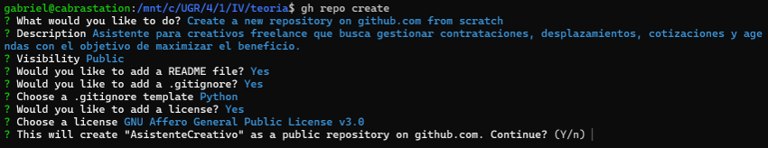
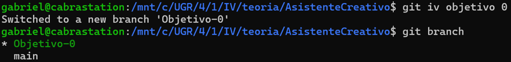
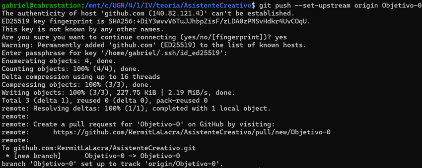

# Configuración del entorno de trabajo

## 1- Creación del repositorio utilizando GitHub CLI  
  

## 2- Creación de la branch "Objetivo-0" utilizando el plugin "iv"
  

## 3- Comprobación de la clave SSH
  